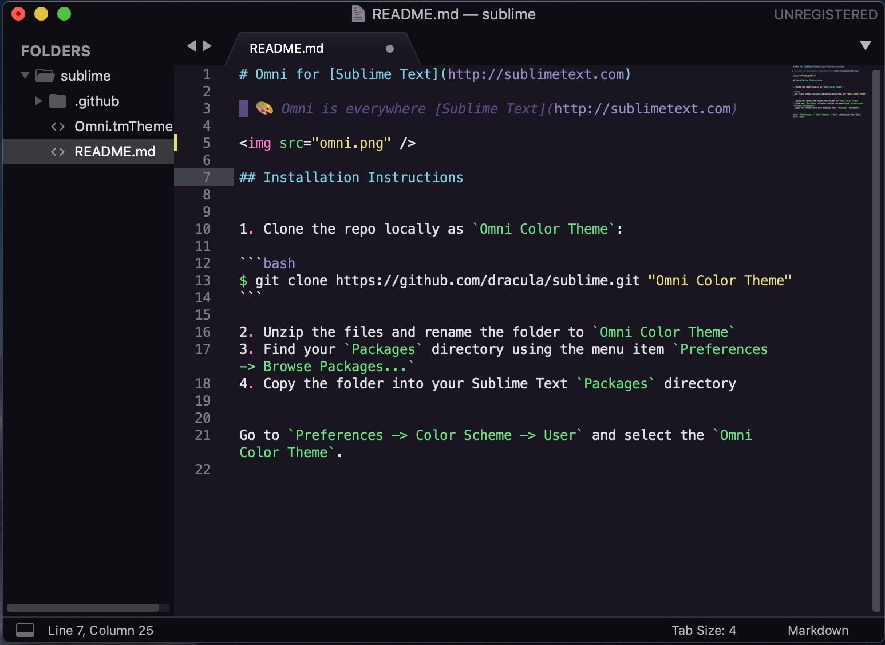

# Omni for [Sublime Text](http://sublimetext.com)

> 🎨 Omni is everywhere [Sublime Text](http://sublimetext.com)



## Installation Instructions

1. Clone the repo locally as `Omni Color Scheme`:

```bash
$ git clone https://github.com/librity/omni-sublime "Omni Color Scheme"
```

2. Open Sublime and navigate to `Sublime -> Preferences -> Browse Packages...`
3. Copy `Omni Color Scheme` into Sublime's `Packages` directory
4. Navigate to `Sublime -> Preferences -> Color Scheme` and select the `Omni Color Scheme`
